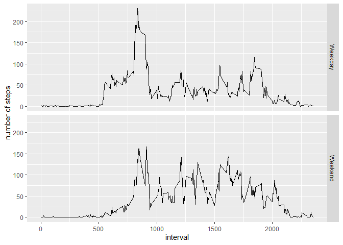

## Activity Monitoring
This is a report regarding the activities monitorized by a personal activity monitoring device. This device collects data at 5 minute intervals through out the day. The data consists of two months of data from an anonymous individual collected during the months of October and November, 2012 and include the number of steps taken in 5 minute intervals each day.
These are the questions I aim to answer: 
What is mean total number of steps taken per day? 
What is the average daily activity pattern? 
Are there differences in activity patterns between weekdays and weekends?

## Loading the data

```r
dataactivity<-read.csv("activity.csv")
```


## What is mean total number of steps taken per day? 

```r
q1<-aggregate(steps~date,dataactivity,sum)
hist(q1$steps,main = "Steps per day",xlab="Steps",ylab = "Freq")
```

<!-- -->

```r
summary(q1$steps)
```

```
##    Min. 1st Qu.  Median    Mean 3rd Qu.    Max. 
##      41    8841   10765   10766   13294   21194
```
Steps per day with
## What is the average daily activity pattern?

```r
q2<-aggregate(steps~interval,dataactivity,mean)
plot(q2$interval,q2$steps,type="l",main="Daily Activity Pattern",xlab = "Interval",ylab = "Average Steps")
```

<!-- -->
Which 5-minute interval, on average across all the days in the dataset, contains the maximum number of steps? 
The interval 835:

```r
summary(q2$steps)
```

```
##    Min. 1st Qu.  Median    Mean 3rd Qu.    Max. 
##   0.000   2.486  34.113  37.383  52.835 206.170
```

```r
subset(q2,steps>206)
```

```
##     interval    steps
## 104      835 206.1698
```
## Imputing NA values
Total number of NAs in the dataset:

```r
colSums(is.na(dataactivity))
```

```
##    steps     date interval 
##     2304        0        0
```
New dataset - "NA_filled" - with the missng data filled in -- Strategy for filling in all of the missing values in the datase using the mean for the 5-minute interval:

```r
NA_filled<-dataactivity
for (i in which(sapply(NA_filled, is.numeric))) {
    for (j in which(is.na(NA_filled[, i]))) {
        NA_filled[j, i] <- mean(NA_filled[NA_filled[, "interval"] == NA_filled[j, "interval"], i],  na.rm = TRUE)
    }
}
head(NA_filled)
```

```
##       steps       date interval
## 1 1.7169811 2012-10-01        0
## 2 0.3396226 2012-10-01        5
## 3 0.1320755 2012-10-01       10
## 4 0.1509434 2012-10-01       15
## 5 0.0754717 2012-10-01       20
## 6 2.0943396 2012-10-01       25
```

Steps per day without missing values

```r
NA_filledsum<-aggregate(steps~date,NA_filled,sum)

hist(NA_filledsum$steps,main = "Steps per day -NA",xlab="Steps",ylab = "Freq")
```

<!-- -->

Mean and median of the steps per day without missing values

```r
summary(NA_filledsum$steps)
```

```
##    Min. 1st Qu.  Median    Mean 3rd Qu.    Max. 
##      41    9819   10766   10766   12811   21194
```

 Do these values differ from the estimates from the first part of the assignment? What is the impact of imputing missing data on the estimates of the total daily number of steps?

The mean didn't change but the median changed in 1 step of difference.

## Are there differences in activity patterns between weekdays and weekends?
 New factor variable in the dataset with two levels – “weekday” and “weekend” indicating whether a given date is a weekday or weekend day:

```r
library(lubridate)
```

```
## Warning: package 'lubridate' was built under R version 3.6.2
```

```
## 
## Attaching package: 'lubridate'
```

```
## The following object is masked from 'package:base':
## 
##     date
```

```r
NA_filled$date<-as.Date(NA_filled$date)
NA_filled$day <-ifelse(as.POSIXlt( NA_filled$date)$wday %in% c(0,6), "Weekend", "Weekday")
head(NA_filled)
```

```
##       steps       date interval     day
## 1 1.7169811 2012-10-01        0 Weekday
## 2 0.3396226 2012-10-01        5 Weekday
## 3 0.1320755 2012-10-01       10 Weekday
## 4 0.1509434 2012-10-01       15 Weekday
## 5 0.0754717 2012-10-01       20 Weekday
## 6 2.0943396 2012-10-01       25 Weekday
```
Average number of steps per weekend/weekday:

```r
NA_filledmean<-aggregate(steps~interval + day,NA_filled,mean)
library(ggplot2)
```

```
## Warning: package 'ggplot2' was built under R version 3.6.2
```

```r
ggplot(NA_filledmean, aes(interval, steps)) + geom_line() + facet_grid(day ~ .) + xlab("interval") + ylab("number of steps")
```

<!-- -->


## 

